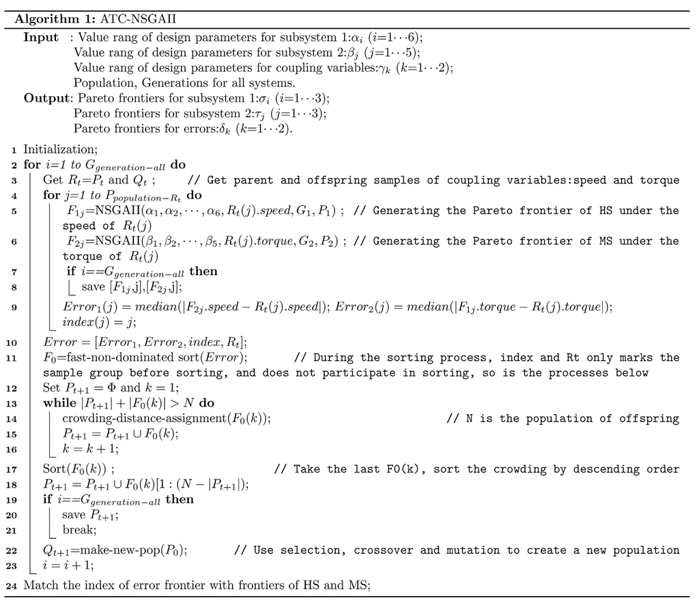

# ANN-ATC-NSGAII
This is a new Algorithm based on NSGAII for optimizing a multi-system such as pVADs. On this page you can download the source code and run it in MATLAB higher than 2020 version.

### How the scripts run

| File Name                      | Function                                                     |
| ------------------------------ | ------------------------------------------------------------ |
| main                           | The main function                                            |
| nsga_all                       | Sort the current popultion for coupling variables            |
| nsga_2                         | Sort the current popultion for subsystem 1                   |
| nsga_3                         | Sort the current popultion for subsystem 2                   |
| initialize_variablesall        | Initialize the chromosomes for coupling variables            |
| initialize_variables           | Initialize the chromosomes for subsystem 1                   |
| initialize_variables2          | Initialize the chromosomes for subsystem 2                   |
| genetic_operatorall            | Produce offsprings from parent chromosomes for coupling variables |
| genetic_operator               | Produce offsprings from parent chromosomes for subsystem 1   |
| genetic_operator2              | Produce offsprings from parent chromosomes for subsystem 2   |
| evaluate_objectiveall          | Evaluate the objective functions of errors between subsystems |
| evaluate_objective             | Evaluate the objective functions of the subsystem 1          |
| impellerfit                    | ANN fitting function for subsystem 1(The Hydraulic system of pVADs here) |
| evaluate_objective2            | Evaluate the objective functions of subsystem 2              |
| bldcfit                        | ANN fitting function for subsystem 1(The Motor system of pVADs here) |
| non_domination_sort_mod        | Sort the current population based on non-domination          |
| objective_description_function | Completely describe the objective functions and the range for the decision variable space etc. |
| replace_chromosome             | Replace the chromosomes based on rank and crowding distances. |
| Tournament_selection           | Selection policy for selecting the individuals               |

It should be careful that all the .mat files generated during the running are intermediate variables for communications. 

A better description of the algorithm in pseudocode mode is presented here:

### How to run this example

By running this scripts, you need to open this file folder in MATALB, and run the "**main.m**". In "main.m" you can vary the number of generations and samples of function "nsga_all", which is the outer loop for the algorithm.

From the files named with "nsga", you can vary the scope of the design parameters of coupling variables and subsystems correspondingly.

If one needs to change the function of subsystems, it could be done by replacing the file "impellerfit.m" and "bldcfit.m" by your own scripts, but one have to be careful to the numbers of the variables.

### The results

The results are output in the form of txt files in ASCII. The files named after "impeller\_" or "Motor\_" represents the results of Pareto Fronts of the two subsystems. The number behind represents the index of the individual from outer loop NSGAII after the final generation. Some times the number is less or more than the population due to the genetic operations. The "solutionall.txt" saves the results of the coupling variables only. The "solutionall2.txt" saves the final results and involves the best coupling design for each design point in outer loop.

### Instructions on genetic operations

In this case, all the genetic operations are set to be the same scheme, with 90 % probability of performing crossover, 10% for mutation. Thus the results may be different each time you run it. Thus, several times(5 times approximately for this case) of running is recommended.

Another characteristic is in "solutionall2.txt", you can only find the final design scheme. But if you want to find out the Pareto Front of the subsystem where the design parameters lies. You just need to take out the coupling variables and run the  "nsga_2" and "nsga_3" after checking the codes. That is an expand feature and not included in this case.
